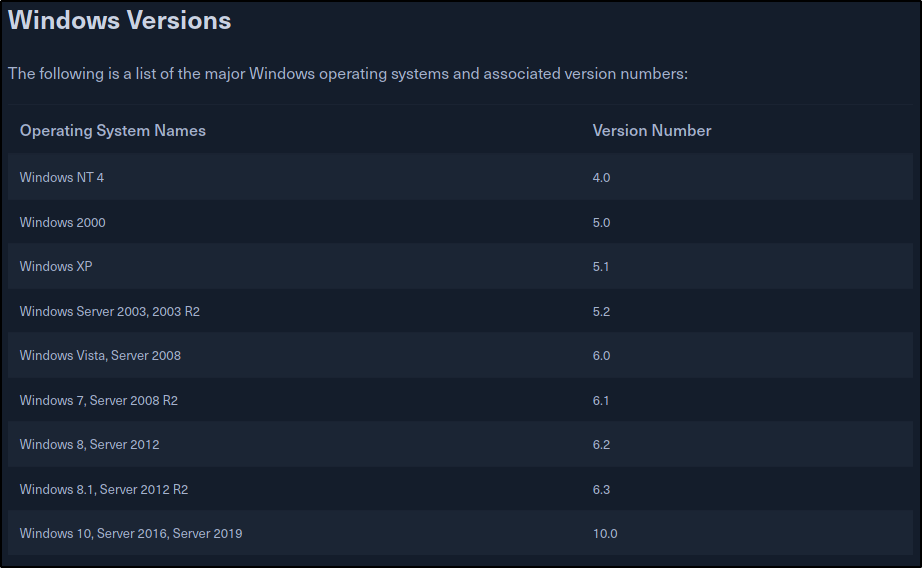

# Windows-Fundamentals-Walkthrough-1
Windows Fundamentals Introduction to Windows module walkthrough 

<!DOCTYPE html  PUBLIC '-//W3C//DTD XHTML 1.0 Transitional//EN'  'http://www.w3.org/TR/xhtml1/DTD/xhtml1-transitional.dtd'>
<html xmlns="http://www.w3.org/1999/xhtml">
	<head>
	<meta content="text/html; charset=utf-8" http-equiv="Content-Type"/>
	<title>Introductory to Windows</title>
	</head>

	<body>
			<h1>Introduction to Windows</h1>
				<h3>The Windows Operating System</h3>
						 
					
Windows 1985'ten beri işletim sistemleri üretmektedir. Windows'un ilk versiyonu 1985'te üretilmiş MS-DOS için oluşturulmuş bir grafik işletim sistemi kabuğudur.

						 
					
Daha sonra 1995 yılında Windows 95 çıkmıştır. Bu versiyonla birlikte ilk defa yerleşik internet desteği ve o zamanlar yaygın olarak kullanılan Internet Explorer tarayıcısı gelmiştir. Bu şekilde Microsoft Şirketi günümüze kadar Windows XP'den tut Windows 10'a kadar hem normal hem de kurumsal müşteriler için bir çok işletim sistemi geliştirdi ve satışa sundu.

						 
						 
				<h3>Windows Servers</h3>
						 
					
Windows sadece işletim sistemleriyle kalmadı aynı zamanda serverlar da geliştirdi. İlk Windows Server 1993 yilinda Windows NT 3.1 olarak satışa sunuldu. Windows Serverlar da günümüze kadar Internet Information Services (IIS), bir çok ağ protokolü, admin görevlerini kolaylastirmak için Administrative Wizards gibi bir çok guncelleme ve yeni teknoloji aldi.

					 
					
Windows 2000'in yayinlanmasiyla Microsoft, sistem yöneticilerinin dosya paylaşımı, veri encryption ve VPN kullanımına yarayan <b>"Active Directory"</b> hizmetini Windows Serverlara ekledi. Microsoft kendini güncellemeye devam etti ve Windows Server 2003, Windows Windows Server 2008, Windows Server 2012, Windows Server 2016 ve sürümün son versiyonu olan Windows Server 2019'u yayınladı.

						 
					
 Microsoft şirketi, çeşitli nedenlerle Windows'un eski versiyonlarina cok buyuk guvenlik acikliklari haricinda (SMBv1 Eternalblue) gibi guvenlik acikliklari disinda guncelleme yapmiyor. Hatta çok yakın zamanda Windows 7'den desteğini çektiğini hatırlayacaksınız.

						 
						
Geçmişten günümüze Windows:

						 
					 
						 
						 
				<h3>Get-WmiObject</h3>
					
Windows'ta işletim sistemi hakkında bilgi almak için <b>Get-WmiObject</b> cmdlet'ini kullanabiliriz. Bu cmdlet'i WMI classları hakkında bilgi toplamak için kullanırız. Sistem versiyon ve build number (yapı numarası) bilgilerini toplamak için <b>win32_OperatingSystem</b> classını kullanabiliriz.

						 
						 
					 
						 
						 
					
Kullanabileceğimiz bir diğer class olan <b>Win32_Process</b> classını processes listesini almak için kullanabiliriz

						 
					
Sonuç buna benzer upuzun bir liste:

						 
					 
						 
						 
						 
					
Yine kullanabileceğimiz bir diğer class ise Win32_Bios servislerinin listesini ve onlar hakkında bilgi almak için <b>Win32_Service </b>class'dır

						 
					
Sonuç yine bunun gibi uzun bir liste:

						 
					 
						 
					
GetWmiObejcet cmdlet'i hakkında daha fazla bilgi için<a href="https://ss64.com/ps/get-wmiobject.html"> buraya </a>ve <a href="https://adamtheautomator.com/get-wmiobject/">buraya</a> tıklayabilirsiniz.

						 
						 
				<h2>SORULAR:</h2>
						 
						 
					
Hedef makineye bağlanabilmemiz için akademinin VPN ağının içinde bulunmalıyız. İlk olarak bize verilen <b>ovpn</b> dosyasını şekildeki butondan indiriyoruz:

						 
						 
					 
						 
					
Daha sonra aşağıda gösterilği gibi openvpn ile akademinin VPN'ine bağlanıyoruz:

						 
						 
					 
						 
					
Makinemizi çalıştırıyoruz:

						 
					 
						 
					
Daha sonra bize verilen username ve password ile RDP bağlantımızı kuruyoruz:

						 
						 
					 
						 
					 
						 
					 
						 
						 
					
Ve bağlantımız geliyor:

						 
					 
						 
						 
					
Win + S kombinasyonuyla arama çubuğunu açıyoruz ve Powershell'i çalıştırıyoruz

						 
					 
						 
						 
				<h3>SORU 1</h3>
						 
						 
					 
						 
					
İlk soruda hedefimizin Build Number'ını istiyor bu sebeple <b>Get-WmiObject</b> cmdlet'ini <b>win32_OperatingSystem</b> class'ıyla kullanıyoruz.

						 
						 
					 
						 
					
Ve karşımızda Build Number 

						 
						 
				<h3>SORU 2</h3>
						 
						 
					
						 
						 
					
Soru bize hedefte hangi Windows NT versiyonun bulunduğunu soruluyor.

						 
					
Bu bilgiyi edinmek için systeminfo cmdlet'ini kullanabiliriz

						 
						 
					
						 
						 
					
Hedefin Windows 10 kullandığını görebiliyoruz.

						 
						 
				<h3>CEVAPLAR<h3>
						 
						 
					
						 
						 
				<h4>Bu modül için kullanılan cheat sheet:</h4>
						 
						 
					
						 

	</body>
</html>
